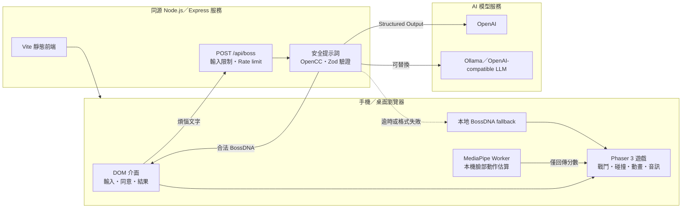

# NOXCAT: FEEL NOTHING

> **面對煩惱 Feel Nothing; NOXCAT 讓你 Do Everything**

<p align="center">
  
</p>

## 問題與目標

下班、下課或是完成一段高壓工作後，人們明明需要休息，但卻難以從壓力與焦慮轉換過來。因此我們希望提供一個低門檻的情緒發洩，將自己的煩惱命名，讓 AI 將個煩惱轉譯成一個緊張刺激的 NOXCAT Boss 戰。
玩家不再只是被動的觀看文字，而是親手拖曳 NOXCAT 閃避攻擊，透過面無表情累積 Do Everything 能量，再把 NOXCAT 像果凍炮彈一樣彈射出去，從「命名煩惱」，「轉譯煩惱」最終「掌控煩惱」，在遊戲過程中也能釋放壓力，成為壞心情的主人！透過可愛的 NOXCAT IP 的陪伴在每一局結束後，都能比開始前少掉更多煩惱。


## 核心功能

> **輸入煩惱**<br>
> AI 生成專屬名稱、台詞與攻擊方式。
>
> **面無表情，累積能量**<br>
> 拖曳 NOXCAT 閃避攻擊，面無表情，累積 FEEL NOTHING 能量。
>
> **拉開、瞄準、放手**<br>
> 把 NOXCAT 化身果凍砲彈，替今天的煩惱畫下句點！


- **AI 煩惱編譯器**：將最多 80 字的玩家輸入轉成通過 Zod 驗證的 `BossDNA`，包含 Boss 名稱、台詞、主題、亂數 seed 與既有攻擊參數。AI 不會生成或執行任意程式碼。
- **NOXCAT 果凍 Boss 戰**：以單指拖曳閃避彈幕、擦彈充能，能量滿後向後拉伸 NOXCAT，再放手彈射並撞擊 Boss 弱點。
- **九種不同攻擊**：所有攻擊順序與布局使用 seeded RNG；同一份 BossDNA 可重現相同的戰鬥編排，並保留預警、安全路徑與低血量動態調整。
- **可反彈文件**：特殊文件同時使用外框、旋轉箭頭及音效區分；玩家高速撞擊後可將它反射回 Boss。
- **自適應節奏與聲音**：`PacingDirector` 隨剩餘時間與戰況調整攻擊節奏；音樂與合成音效會回應擦彈、受傷、蓄力、發射及 Boss 命中。
- **可選 Neutral 挑戰**：經玩家同意後，以 MediaPipe 在裝置上估算笑、張嘴、抬眉與睜眼等可見臉部動作。鏡頭影像不會上傳、錄影或儲存，且拒絕相機仍可完成遊戲。
- **離線與失敗降級**：模型逾時、回傳格式錯誤、斷網或未設定模型服務時，自動採用本地 fallback Boss，不讓 AI 成為無法開始遊戲的單點故障。
- **手機瀏覽器優先**：直式全螢幕、safe-area、觸控輸入、失焦暫停、低 FPS 視覺降級及 Android／iPhone Playwright profiles。

## 系統架構



前端、API 與 production 靜態檔案由同一個 Express process 提供，因此不需要跨來源設定。相機 frame 僅在瀏覽器內傳入 Face Landmarker Worker；伺服器的 `/api/boss` 只接收煩惱文字，不接收影像。專案不使用資料庫、登入、cookie 或玩家追蹤資料。

AI 的責任被限制在已實作的遊戲空間內：模型只能選擇 schema 允許的主題、攻擊 enum、強度及短文案；實際傷害、碰撞與遊戲規則仍由確定性的 Phaser 程式控制。

## 使用技術

| 類型 | 技術／服務 | 用途 |
| --- | --- | --- |
| AI 模型 | Server 端部署的 gemma4-e2b | 將玩家煩惱生成結構化 BossDNA 與戰鬥台詞 |
| AI 驗證 | Zod、OpenCC | 限制 AI 輸出結構、拒絕未知機制，統一為臺灣繁體中文 |
| 裝置端視覺 | MediaPipe Face Landmarker | 在本機估算可見臉部動作並計算遊戲化 Neutral 分數 |
| 前端 | TypeScript、Phaser 3.90、Vite 8、純 CSS | 遊戲主循環、手機操作、視覺動畫、HUD 與頁面流程 |
| 後端 | Node.js 22、Express 5、OpenAI JavaScript SDK | 同源靜態服務、`/api/boss`、模型呼叫、安全限制與 fallback |
| 測試 | Vitest、Playwright、ESLint、TypeScript strict | 單元測試、手機瀏覽器 E2E、lint、型別與 production build 驗證 |
| 部署 | GitHub Actions、systemd、Ubuntu server | 通過 CI 後部署、健康檢查及失敗回滾 |
| Sponsor 技術／素材 | NOXCAT 官方 IP 素材（第七賽道） | 角色、Logo、世界觀與「Feel Nothing. Do Everything.」玩法轉譯 |

## 安裝與執行

需求：Node.js 22.12 以上與 npm。

```bash
git clone https://github.com/justinlin099/NOXCAT--Feel-Nothing.git
cd NOXCAT--Feel-Nothing
npm install
cp .env.example .env
npm run fetch:face-model
npm run copy:mediapipe
npm run dev
```

開啟 `http://localhost:4173`。若未提供模型服務，遊戲會使用本地 fallback Boss，仍能完成整局。

使用 OpenAI cloud 時，修改 `.env`：

```env
OPENAI_BASE_URL=
OPENAI_MODEL=gpt-5-mini
OPENAI_API_KEY=填入伺服器端金鑰
OPENAI_TIMEOUT_MS=5500
PORT=4173
```

使用本地 Ollama 時，服務必須提供支援 JSON Schema response format 的 OpenAI-compatible Chat Completions endpoint：

```env
OPENAI_BASE_URL=http://127.0.0.1:11434/v1
OPENAI_MODEL=gemma4:e2b
OPENAI_API_KEY=local-ollama
OPENAI_TIMEOUT_MS=9000
PORT=4173
```

金鑰只由 Node.js server 讀取，不可放入前端 bundle、HTML、localStorage 或公開 repository。

執行完整品質檢查：

```bash
npm run check
npm run test:e2e
```

建立並啟動 production 版本：

```bash
npm run build
PORT=4173 npm start
```

Production 必須使用 HTTPS，相機 API 才能在非 localhost 環境運作。

## 作品展示

- GitHub repository：<https://github.com/justinlin099/NOXCAT--Feel-Nothing>
- 作品展示網址：https://noxcat-dev.hex.tw/
- 評選影片：https://www.youtube.com/watch?v=7g47J8MZPAo

| 開始頁 | 戰鬥畫面 | 結果頁 |
| :---: | :---: | :---: |
|  |  |  |

## 限制與未來工作

### 限制
- Playwright 的 Pixel 5／iPhone 13 是桌面端裝置 profile，不等同真 Android Chrome／iPhone Safari。真機觸控、safe-area、旋轉、音訊解鎖、切換分頁恢復、相機系統指示燈關閉、不同光線／角度與中階手機 55–60 FPS 還需更多測試。
- Boss 目前僅能客製名稱與台詞，尚未支援形象客製化。
- 尚未提供不同造型的 NOXCAT 供玩家選擇。

### 後續發展

- 進行小規模使用者研究，比較遊玩前後的短期主觀壓力，並比較 AI 客製 Boss 與固定 Boss 的體驗差異。
- 在不儲存完整煩惱文字的前提下，分析完成率、操作理解度、重玩率與 NOXCAT 品牌回憶。
- 依測試結果調整新手教學、最後一條命的難度與勝敗結果文案。
- 結合 NOXCAT IP、Slogan 與遊戲成就，串聯實體活動及贈品，作為活動預熱並提升參與感。

## 第三方服務、資料與素材

| 項目 | 來源 | 授權／使用方式 |
| --- | --- | --- |
| NOXCAT 名稱、Logo、角色與官方素材 | 主辦方提供之 NOXCAT 素材包與 IP Usage Guidelines | 不納入本專案 GPL；僅依主辦方／權利人授權使用，companion Asset Licence 待取得確認 |
| Phaser 3.90 | <https://phaser.io/> | MIT License |
| MediaPipe Tasks Vision | <https://github.com/google-ai-edge/mediapipe> | Apache License 2.0；WASM 授權副本位於 `third_party/licenses/` |
| MediaPipe Face Landmarker model | <https://storage.googleapis.com/mediapipe-models/face_landmarker/face_landmarker/float16/latest/face_landmarker.task> | Apache License 2.0；來源與 SHA-256 記載於 `THIRD_PARTY_NOTICES.md` |
| OpenAI JavaScript SDK／API | <https://github.com/openai/openai-node> | SDK 依 Apache License 2.0；API 使用依服務條款與帳戶設定 |
| Ollama | <https://github.com/ollama/ollama> | 本機可選模型服務；各模型權重仍依其個別授權 |
| Express、Vite、Zod、OpenCC、Vitest、Playwright | npm dependencies | 各自依套件隨附授權；完整版本以 `package-lock.json` 為準 |
| Boss、文件與概念視覺 | 專案製作之生成式／衍生素材 | 提交前應補齊生成工具、提示來源及可使用範圍；涉及 NOXCAT 識別者仍受 IP 授權限制 |
| `NULL SIGNAL` 戰鬥配樂與 Web Audio 音效 | 團隊原創 | 音訊替換與來源說明見 `public/assets/audio/music/README.md` |

專案不提交 API key、Token、相機影像、臉部 landmarks 或玩家個人資料。更完整的權利邊界請見根目錄 `LICENSE-SCOPE.md` 與 `THIRD_PARTY_NOTICES.md`。

## 團隊成員

| 姓名 | 分工 |
| --- | --- |
| Justin Lin | 技術統籌、核心玩法、戰鬥與效能系統、手機介面設計 |
| Hex  | AI Boss 生成、後端 API、IP 素材整合、部署維運 |
| Elvis Lo  | 攻擊設計、戰鬥可讀性設計、結果介面、E2E 測試 |
| JiuYang  | 動態難度、戰鬥節奏與平衡測試、主題發想、專案管理 |
| arnoldsky-yu  | 配樂設計、互動音效與音訊系統、技術與規格文件撰寫|


## License

除明確排除的素材及第三方元件外，貢獻者擁有的原創程式碼與文件採 **GNU General Public License v3 only（GPL-3.0-only）**，完整條文見根目錄 `LICENSE`。

NOXCAT 名稱、商標、官方素材、可辨識衍生圖像、截圖與概念圖不在 GPL 授權範圍內；MediaPipe WASM、Face Landmarker model 與其他第三方元件保留各自的授權。詳細適用範圍見 `LICENSE-SCOPE.md`。

---

# Visual references and supplied IP

`visual-reference.png` is an archival copy of
`mockups/01_clean_gameplay_concept.png`. The complete mockup set remains under
`mockups/` as composition, palette, HUD and motion reference only; it is not
official NOXCAT art and is not shipped by the web build.

The organizer-supplied source pack and usage guide may be retained locally and
unchanged under `official-assets-20260904/`. That directory is intentionally
ignored by Git and is not part of the repository distribution. The start
screen ships an exact copy of the official white wordmark, while the combat
character is a separately identified game redraw based on the official logo
proportions. See the project README, `LICENSE-SCOPE.md`, and
`public/assets/ip/noxcat/README.md` for the active mapping and event-only usage
restrictions.

`references/noxcat-logo-official.png` is a small archival web reference captured
before the supplied source pack arrived. It is not loaded or copied into the
production build; the supplied pack is the authoritative reference.
